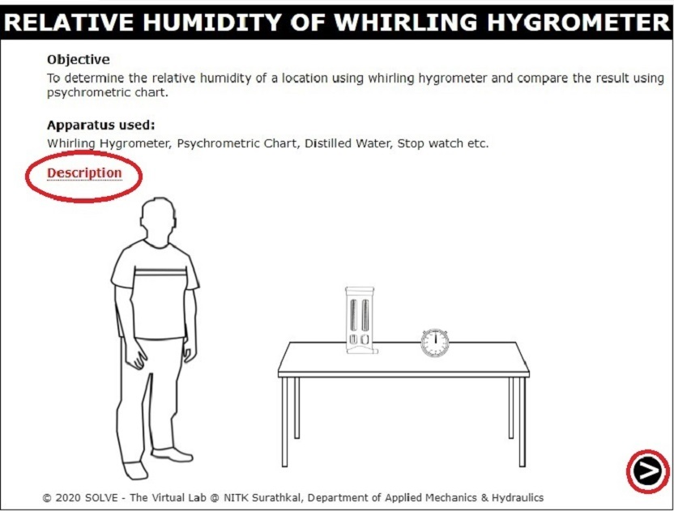
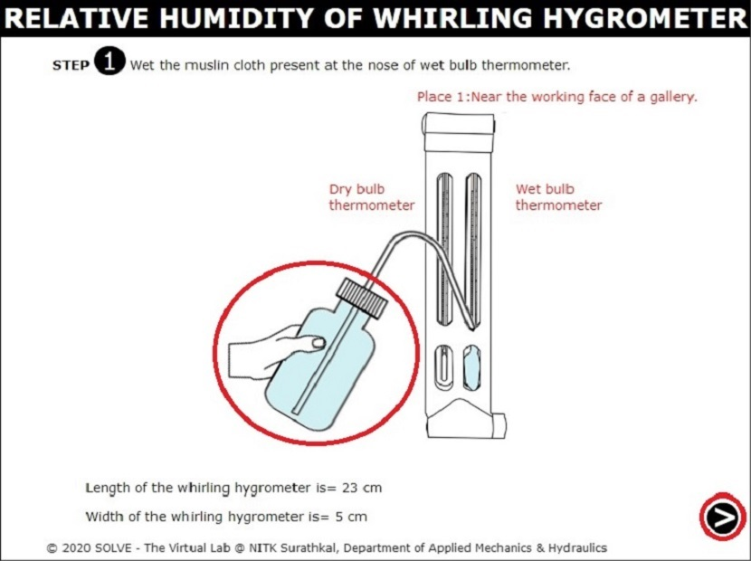

##### These procedure steps will be followed on the simulator

1. When you click on a Relative Humidity of Whirling Hygrometer file, a new window will open as shown below. . Click on the NEXT button at the bottom right corner to proceed to the next step. 
 

2. Click on the Flask to wet the muslin cloth of wet bulb thermometer. Click on the NEXT button at the bottom right corner to proceed to the next step.  
 

3. Click on the hand holding the Whirling Hygrometer. 
 

4. The dry bulb and wet bulb temperatures are depicted here. Then, click on the bottom right corner button to get into next step. 
 

5. The observation at place 1 is given below and put the required value in calculation to check your results. Click on the NEXT button at the bottom right corner to proceed to the next step. 
 

6. Repeat the all above procedure for Place 2 and Place 3 also. Compare the result (Relative humidity) of all three places 1,2 and 3 with psychrometric chart. Click on the NEXT button at the bottom right corner to proceed to the next step. 
 

7.The final result of relative humidity by calculations and psychrometric chart for different places in the working gallery of a mine is given. 
 

